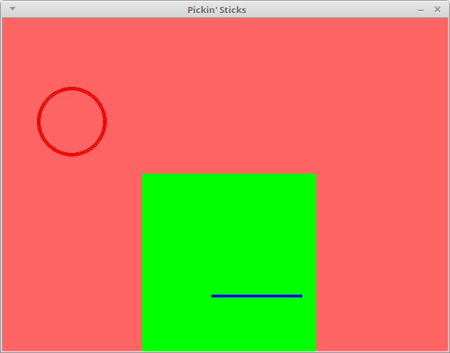

# Explore PyGame!

## What is PyGame?

PyGame is a library that you use with the Python language to use
graphics, audio, and keyboard, mouse, and game controller inputs,
as well as other features.

It is free, cross-platform, and a good place to start if
you're interested in doing game programming outside of
the realm of Greenfoot.

There are a ton of tutorials and example source code
out there on the internet as well as message boards
and communities based around it!

## Getting Started

On PyGame's Getting Started page, it has the steps to install
for Windows, Unix (Linux), and Mac:

[http://www.pygame.org/wiki/GettingStarted](http://www.pygame.org/wiki/GettingStarted)

Follow the directions to get started! (I'm not putting them here
because it's easier for them to keep their stuff up-to-date :)
but we can go over it in class.

# Creating a Python project

## Creating the folder and files

Once you bave everything set up, Python and PyGame sohuld
be on your system. All you have to do is create a source
file (which ends in .py) and run it with the Python program
in order to get a program up-and-running!

It is best to create a folder that will store your source code
as well as any images and sounds you will be using. 

**1. Create a folder called "Pickin Sticks"**
**2. Within that folder, create a file called main.py**

We will be putting our main game program inside the
main.py source file. As we create additional objects
for our game, we will put those in their own .py files.

## Creating a Window in PyGame

The first step is to just to get a window to display
on the screen. In your *main.py* file, you will add the code:

	import pygame, sys 			#import pygame	
	from pygame.locals import * # const values like QUIT, MOUSEMOTION
	import time

	# Initialize pygame
	pygame.init()

	# Make a window whose width is 640 pixels and height is 480 pixels
	window = pygame.display.set_mode( ( 640, 480 ) )

	# Set the text at the top of the window
	pygame.display.set_caption( "Pickin' Sticks" )

	# TEMPORARY: Pause the program
	time.sleep( 2 )

With this code, it's time to try to test it out to make sure that
you have PyGame set up correctly.

In Windows: 

(WIP)

## Drawing shapes and colors

Next, let's draw some shapes to the screen.

Before the end of the program (before the time.sleep), add the following:

	window.fill( pygame.Color( 255, 100, 100 ) )
	pygame.display.update()

This will fill the background with a pinkish color.

Any time we make updates to the screen, we need to call the **pygame.display.update()** function.
Once we have a game loop working, we will call pygame.display.update() at
the end of each cycle.

Test out the code above, make sure it works, then add some shapes:

	# Draw circle. Pass in: window, color, (x,y), radius, thickness
	# x = 100, y = 150, radius = 50, thickness = 5
	pygame.draw.circle( window, pygame.Color( 255, 0, 0 ), ( 100, 150 ), 50, 5 )
	
	# Draw filled-in rectangle. Pass in: window, color, (x1, y1, x2, y2)
	pygame.draw.rect( window, pygame.Color( 0, 255, 0 ), ( 200, 225, 250, 275 ) )

	# Draw line. Pass in: window, color, (x1, y1), (x2, y2), thickness
	pygame.draw.line( window, pygame.Color( 0, 0, 255 ), ( 300, 400 ), ( 430, 400 ), 4 )

	
<strong>
		**View full program code**
	</strong>

	import pygame, sys 			#import pygame	
	from pygame.locals import * # const values like QUIT, MOUSEMOTION
	import time

	# Initialize pygame
	pygame.init()

	# Make a window whose width is 640 pixels and height is 480 pixels
	window = pygame.display.set_mode( ( 640, 480 ) )

	# Set the text at the top of the window
	pygame.display.set_caption( "Pickin' Sticks" )

	window.fill( pygame.Color( 255, 100, 100 ) )

	# Draw circle. Pass in: window, color, (x,y), radius, thickness
	# x = 100, y = 150, radius = 50, thickness = 5
	pygame.draw.circle( window, pygame.Color( 255, 0, 0 ), ( 100, 150 ), 50, 5 )

	# Draw filled-in rectangle. Pass in: window, color, (x1, y1, x2, y2)
	pygame.draw.rect( window, pygame.Color( 0, 255, 0 ), ( 200, 225, 250, 275 ) )

	# Draw line. Pass in: window, color, (x1, y1), (x2, y2), thickness
	pygame.draw.line( window, pygame.Color( 0, 0, 255 ), ( 300, 400 ), ( 430, 400 ), 4 )

	pygame.display.update()

	# TEMPORARY: Pause the program
	time.sleep( 2 )

