# Building a simple portfolio page with GitHub

## What is GitHub?

GitHub is a **source hosting website**. Often, it is used with the software program [Git](https://git-scm.com/) for source code
management in programming projects, but GitHub also features web-based tools you can use,
as well as a simple webpage system you can take advantage of to build your own
simple portfolio page.

## What are we doing?

We will be using GitHub to build a portfolio page, and upload some of the
programming assignments to a repository for others to see, and so that
we can access them later if we need them!

---

# Getting Started

## Create a GitHub account

First, register an account on GitHub. Go to [https://github.com/](https://github.com/)
and click on the "Sign up" button.

* Choose any username - you can always change it later. It might be easiest to use
your school ID for now.
* Email address - use your personal email or school email address.
* Password - specify a password.

Next, there will be a "Choose a plan" section. Just select the **free** plan.

After you're done registering, you can go to **github.com/YOUR_USER_NAME**
to create new repositories and view existing repositories.

For example, my home profile is [https://github.com/racheljmorris](https://github.com/racheljmorris).

---

# Uploading your projects

## Create a repository for your class

Usually, you will create a **repository** per project that you're working on,
but since school assignments are pretty small and managable, we will create
one repository for one class.

From your profile page, click on the **Repositories** tab.

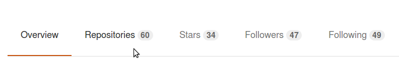

Then, click on the **New** button.

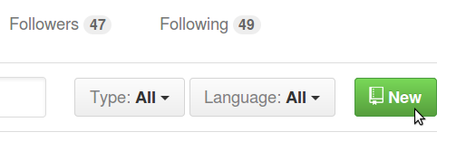

On this page, you will set a **Repository name** and **Description** (optional).

Make sure to set your repository as Public (GitHub is only free for public projects),
and click on **Initialize this repository with a README**.

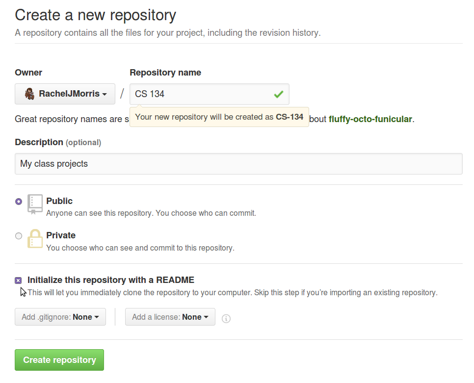

Then click **Create repository** once you're done.

It will take you to the repository page, which currently only has a 
README.md file.

## Create a folder for a project

First, you will want to create a subfolder for one project (otherwise everything
will be in the same directory, and it will be hard to navigate!).

From the web interface, click on **Create new file**.

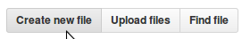

We're going to create a new directory, and the README for that directory.

Let's assume we're going to upload a project named "Flerpy Berd", so I want
the folder to be named that. I'm going to enter the new file name as:

	Flerpy Berd/readme.md
	
After you type "/", it will turn "Flerpy Berd" into a folder, and you'll
be editing the readme for that directory. The readme is the text that shows
up by default in each folder.

Enter this into the text editor, then click **Commit new file**:

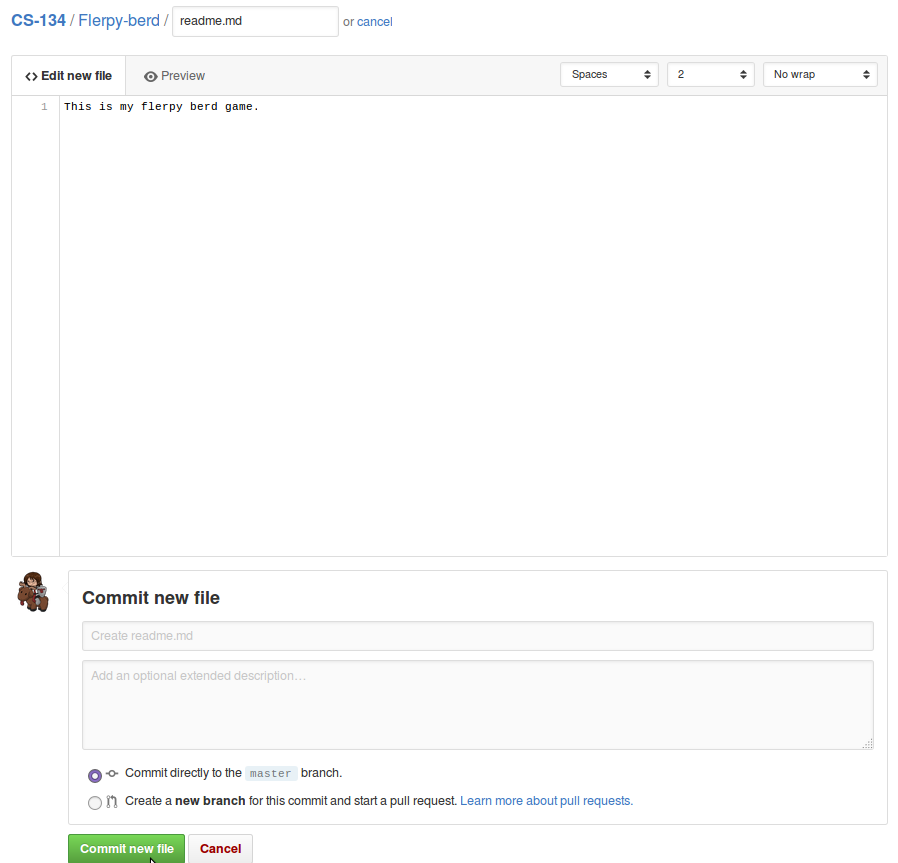

Then you'll be in a subfolder of your class repository:

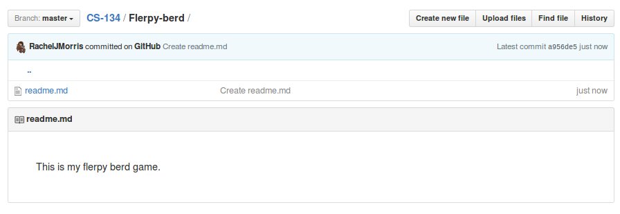

Now that we have a folder created for the project, let's upload our source files.

## Upload your project code

From the subfolder, click on the button that says **Upload files**.
You can use this to add new files to the repository through the web interface.

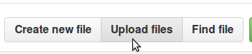

You can drag some files into the gray box, or click on **choose your files** to
manually select them from the directory browser.

Navigate to wherever your project is, and upload the necessary source files:

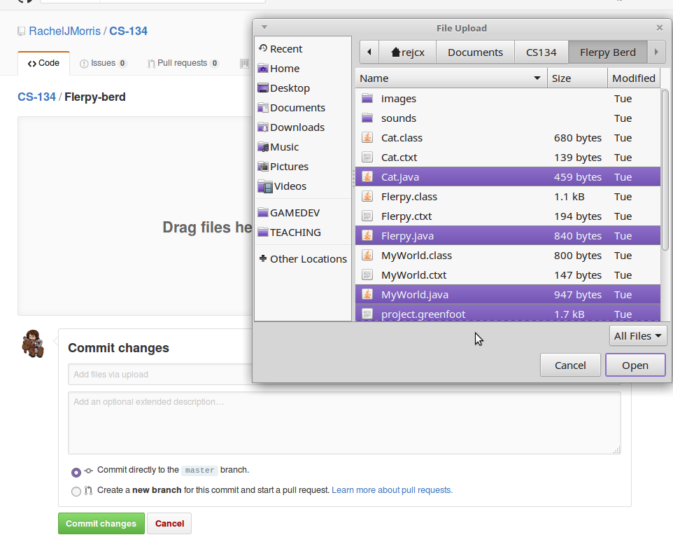

*How do you know which files to upload?*

* .java files are source files for Java
* .cpp, .hpp, and .h files are source files for C++
* .cs files are source files for C#

Generally, you won't want to include anything *but* source files in the
repository - there is a different place to upload a .zip file of all
your project, image, etc. files.

Click on **Commit changes** to finish.

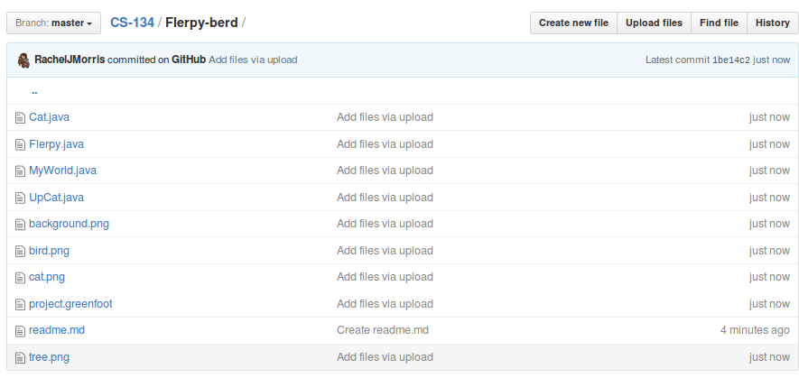

Now you can browse the code that you uploaded from the web interface by
navigating to it and clicking the source file:

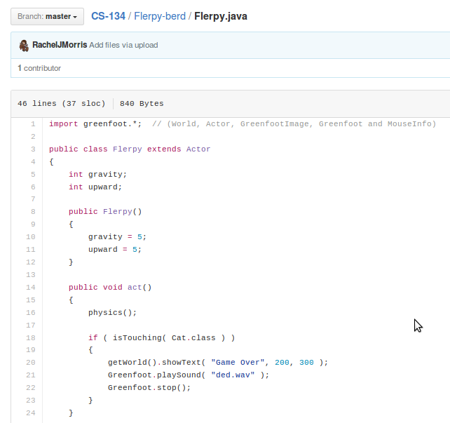

## Upload your "release"

If you want to upload a zip file of a project so that someone can get
the project files, image files, etc., you can do that as a **Release**.

Click on the **releases** tab in the repository:

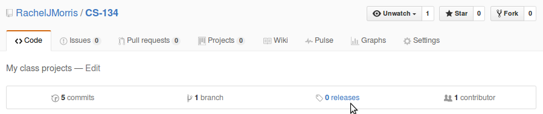

Then click on the **Create a new release** button:

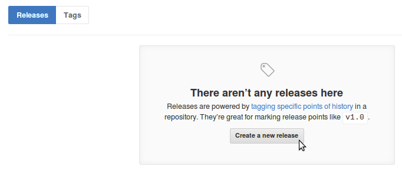

Give your release a tag (like version #), title, description, and under **binaries**, upload
the file or the .zip of your project, then click **Publish release**.

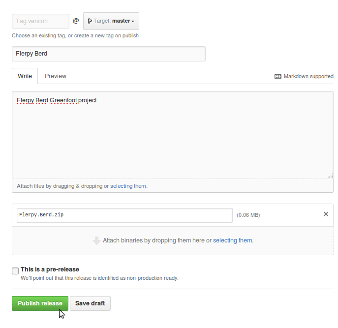

Then your project will be available to download:

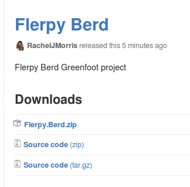

---

# Creating a webpage on GitHub

GitHub also has a system in place for hosting simple webpages, both for
**your own profile**, and **per repository**.

We're going to build a portfolio, so we will just make one for your
entire profile.
