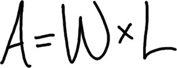
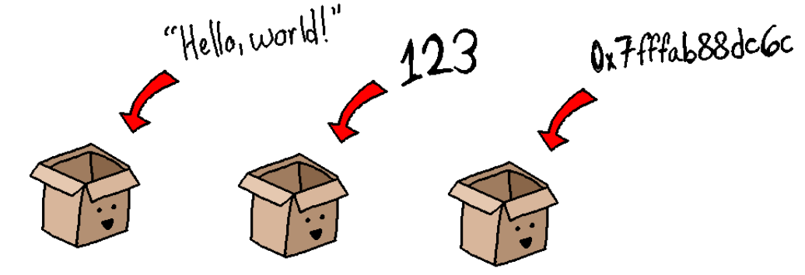

# Summary Notes: Data Types

In algebra, we used variables to store numbers, and to write equations that could be reused with different sets of numbers each time, such as: 

For this formula, A means area, W means width, and L means length - it is the formula for the area of a rectangle. Because variables have been used (instead of "hard-coded" numbers), it can be reused for any rectangle -- you just have to plug in W and L to get the resulting A! 

In our programs, we can store more than just numbers. Each type of data has a different keyword that we can use to specify what kind of variable we're making. 

Some common data types we will be working with are: 

<table class="table">
				<thead>
				<tr>
					<th>
						Data type
					</th>
					<th>
						Keyword
					</th>
					<th>
						Description
					</th>
					<th>
						Example values
					</th>
				</tr>
				</thead>
				
				<tbody>
					
					<tr>
						<td>
							Integer
						</td>
						<td>
							<pre>int</pre>
						</td>
						<td>
							Whole numbers
						</td>
						<td>
<pre>
-5
0
100
</pre>
						</td>
					</tr>
					
					<tr>
						<td>
							Float and Double
						</td>
						<td>
<pre>
float
double
</pre>
						</td>
						<td>
							Numbers with decimal points.
						</td>
						<td>
<pre>
-10.00
9.99
3.14159
</pre>
						</td>
					</tr>
					
					<tr>
						<td>
							Boolean
						</td>
						<td>
<pre>
bool (C++)
boolean (Java)
</pre>
						</td>
						<td>
							Only stores <strong>true</strong> or <strong>false</strong>.
						</td>
						<td>
<pre>
true
false
</pre>
						</td>
					</tr>
					
					<tr>
						<td>
							Character
						</td>
						<td>
							<pre>char</pre>
						</td>
						<td>
							Single letters, numbers, symbols, etc. Characters values must be contained within single-quotes.
						</td>
						<td>
<pre>
'a'
'A'
'$'
'0'
</pre>
						</td>
					</tr>
					
					<tr>
						<td>
							String
						</td>
						<td>
<pre>
string (C++)
String (Java)
</pre>
						</td>
						<td>
							Text, numbers, letters, anything. String values must be contained within double-quotes.
						</td>
						<td>
<pre>
"Hello!"
"12345 College Blvd"
"1... 2... 3..."
</pre>
						</td>
					</tr>
					
					
				</tbody>
			</table>

## Crunching the numbers

Programming is all about manipulating data. Some of the main functionality we will be dealing with include: 

* Comparing if two values are equal
* Comparing if two values are *not* equal
* Comparing if one value is larger than another value

Programs are essentially a series of "yes/no" questions because, again, computers only understand binary: Yes or no, 1 or 0, true or false.
Any question we ask, like "is A and B equal?" or "is A equal to 20?" result in a boolean value -- either true or false. 

Our program logic will consist of branches and loops, and the program decides whether to branch or loop based on these "yes/no" questions... 

* If height is greater than 4 ft, allow on the roller coaster...
* If customer wants beer AND the customer's age is 21 or greater, then serve beer...
* While the countdown is greater than 0, go down by 1...
* While the user has not selected "exit", keep running the program...
* While the user's choice is less than (minimum) AND the user's choice is greater than (maximum), display an error message...

## Hard-coded values

In our programs, we will be storing data in our variables, so we can compare values between two different variables - but we don't always have to. It is perfectly valid to ask "is A equal to 4?" as well as "is A equal to B?", so remember that you can use hard-coded values as well! 

## Relational operators

To ask these questions, we will utilize relational operators: 

<table class="table">
				<thead>
					<tr>
						<th>Name</th>
						<th>Operator</th>
						<th>Question</th>
						<th>Example</th>
					</tr>
				</thead>
				
				<tbody>
					<tr>
						<td>
							Less than
						</td>
						<td>
							&lt;
						</td>
						<td>
							Is A less than B?
							</td><td><pre>A &lt; B</pre>
						</td>
					</tr>
					
					<tr>
						<td>
							Less than or equal to
						</td>
						<td>
							&lt;=
						</td>
						<td>
							Is A less than, or equal to, B?
							</td><td><pre>A &lt;= B</pre>
						</td>
					</tr>
					<tr>
						<td>
							Greater than
						</td>
						<td>
							&gt;
						</td>
						<td>
							Is A greater than B?
							</td><td><pre>A &gt; B</pre>
						</td>
					</tr>
					
					<tr>
						<td>
							Greater than or equal to
						</td>
						<td>
							&gt;=
						</td>
						<td>
							Is A greater than, or equal to, B?
							</td><td><pre>A &gt;= B</pre>
						</td>
					</tr>
					
					<tr>
						<td>
							Equal
						</td>
						<td>
							==
						</td>
						<td>
							Is A equal to B?
							</td><td><pre>A == B</pre>
						</td>
					</tr>
					
					<tr>
						<td>
							Not equal to
						</td>
						<td>
							!=
						</td>
						<td>
							Is A and B not equal?
							</td><td><pre>A != B</pre>
						</td>
					</tr>
					
				</tbody>

			</table>

### Warning! Common error

Make sure to notice that the operator for "is equal?" is TWO equal signs: ==.
A common programming error (and hard to see when trying to look for the error!) is to use a single equals sign = instead of two == within your statements that ask if two things are equal.

Remember this rhyme: To compare if two things are equal, your equal-sign needs a sequel!

Remedy: Be extra mindful when writing conditionals that compare if two things are equal!

---

# Vocabulary

Learning the vocabulary (aka jargon) of programming is essential so that you can effectively communicate with your peers, teacher, and other programmers! 

*    Data type
*    Integer
*    Float
*    Double
*    Character
*    String
*    Boolean
*    Relational operator

# Theory

Beyond just knowing the syntax and grammar of a programming language, it is also important to understand why things work the way they do.
In some cases, you can simply memorize and take for granted for now, but make sure you're familiar with these ideas! 

* Programming languages use data types to explicitly specify what kind of data a variable is storing. 
* Programming is all about asking yes/no questions, at the most basic level. 

# Review

1.    Integers can store what kind of information?
2.    Doubles can store what kind of information?
3.    Strings can store what kind of information?
4.    Characters can store what kind of information?
5.    Booleans can store what kind of information?
