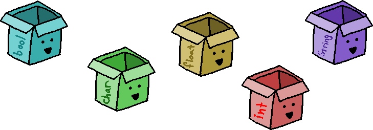

# Summary Notes: Variables

## Introduction

 Variables are a location where you store data.
This data can be numbers, strings, boolean values, memory addresses, and many other things. Eventually, we will be creating our own data types and store data in our own custom variables.

But for now, we're sticking to the language's fundamental data types: Integers, floats, booleans, chars, as well as more sophisticated data types, like strings.

Once we've created our variables, we will be using them to ask questions -- are the equal to this value, are they greater than something else, and so on.

But first thing is first... 

## Declaring variables

 Before we start using variables in our C++ and Java programs, we need to declare them.

When declaring a variable, the bare minimum you need to specify is the data type and the variable name: 

### C++

	int amountOfKittens;
	double pricePerSandwich;
	bool isSaved;
	string username;

### Java

	int amountOfKittens;
	double pricePerSandwich;
	boolean isSaved;
	String username;

Once a variable is declared in C++ and Java, it cannot change its type.

### Warning! Common error

You can re-use variable names in these programming languages, and your development environment isn't going to mark it as an error.

Because of this, a common error is to re-declare a variable using the same variable name. These are effectively different variables, leading to confusion when you store data in one variable, and it doesn't show up in the other!

Remedy: Remember that you only need to declare a variable once! If you've already declared your variable, just reference it by name - don't declare it an additional time each time you need it!

You can name your variable anything that you'd like, so long as it abides by the language's naming standards. However, most languages have a specific style guide that most code in that language follows!  

## Naming rules

 You can generally name your variable anything that you'd like, but there are a few rules to follow when doing so...:

1.    A variable name must begin with a letter (a-z, A-Z), underscore (_), or a dollar sign ($).
2.    You can include numbers in a variable name (0-9), but it cannot be the first character.
3.    The variable name can have virtually any length.
4.    You can use upper-case and lower-case letters in your variable names, but there is a naming convention that you should try to follow. Also, remember that variable names are case-sensitive.
5.    Reserved keywords (such as "if", "int", "public") cannot be used as variable names.

## Naming conventions

 Languages may differ slightly on naming conventions, and even companies might have their own style guide that the expect their employees to follow.

Oracle maintains a Java code convention standard, which you can view on the [Oracle website](http://www.oracle.com/technetwork/java/codeconventions-135099.html).
C++ isn't owned by any one company, so there isn't really an official documentation, but companies (like Google) and projects (GCC C++) have their own conventions. 

Some general naming conventions are...  

#### 1. Variable names begin with a lower-case letter, with every word after the first word starting with a capital letter. (This is called camel casing) 

	int amountOfKittens;

#### 2. Function names in C++ should use camel-casing, with the first word also having a capitalized letter. (In Java, the first letter is lower-case, like a variable). 

C++:

	float GetPrice();

Java:

	float getPrice();

#### 3. Class names should use camel-casing, with the first word also having a capitalized letter.

	class DataPacket { ... }

For the time being, we haven't even talked about what a function or a class is, so this is just reference for later on.
Whatever your programming style ends up being, the important part is to remain consistent! 

## Self-documenting code

 Your variable names don't have a maximum length. (Well, they do, but it's really unlikely that you'd hit that max!)
Because of this, you can use this opportunity to create self-documenting code!

Give your variables descriptive names! Don't abbreviate! By having descriptive names, it is much easier to tell what your code does just by glancing at it. This also minimizes the need for...
/* Comments! */

## Assigning values to variables

During a variable declaration, or afterwards, you can assign values to your variables with the assignment operator.
That is, the equal sign: = 

C++:
	
	int amountOfKittens = 10;
	double pricePerSandwich = 9.99;
	bool isSaved = false;
	string username = "Koneko";

Java:  

	int amountOfKittens = 10;
	double pricePerSandwich = 9.99;
	boolean isSaved = false;
	String username = "Koneko";

You can also declare multiple variables at one time, so long as they're the same data-type: 

	int apples, oranges;
	string person1, person2;

### Variable assignment

During a variable declaration, or any time after a variable has been declared, you can assign values to it. To do so, use the variable's name, the assignment operator (an equal sign =), and the value you want to set it to.
You can set a variable either equal to some other variable (which copies its data over), or to a hard-coded value (like explicitly writing in a number or string.) 

	float price;
	price = 9.99;
	float halfPrice = 9.99 / 2;

### Variable initialization

The act of assigning a variable its very first value is known as initialization.
Without initializing a variable, you cannot (or should not) use that variable, because you can't rely on what its value is. 

#### Warning! Common error

In C++, it is possible to declare a variable and not give it an initial value. If you do this, C++ is going to put garbage in the variable - it does not initialize the variable to anything.

In Java, if you declare a variable and try to use it in your code without initializing it, Java won't let you build your program.

Remedy: The best way around this error is to get used to initializing your variables when you're declaring them!

## Using variables

After the variable has been declared, you do not need to keep specifying its data type - you just need to reference the variable by name. You can utilize the variable to calculate new values, to compare values, get user input, display output to the screen, and more. 

	float price = 9.99;
	float tax = 0.11;
	float total = price + price * tax;

---

# Vocabulary

*    Variable declaration
*    Variable initialization
*    Data type
*    Assignment operator

# Theory

*    In Java and C++, variables must be declared prior to use.
*    In C++, if you don't initialize a variable, it will contain garbage by default.
*    In Java, if you don't initialize a variable and try to use it in your program, your program will not build.
* It is possible to declare two variables with the same name in some ways. This is the cause of some common errors.

# Review

1.    When declaring a variable in C++/Java, what information is required?
2.    What symbol is used to assign a value to a variable?
3.    Write variable declarations on paper:
	1.    A variable named year, whose data type is an integer. Assign it a value 1980.
	2.    A variable named cheese, whose data type is a string. Assign it a value "Gouda".
	3.    A variable named money, whose data type is a char. Assign it a value of '$'.
