# Introduction to Source Control - Command Line

## Introduction

In the other document, we go over creating a GitHub account, creating repositories, and uploading files.

The proper way to use Git is from a software program that will bring down your code directly on your computer. 
You can do this from the command line, and there is a set of a few commands you will need to be familiar with
to the basic functionality.

## Setup

You will need to download Git from [git-scm.com](https://git-scm.com/) and install it.

From the command line, you will want to set up a few things in git, so that
your commits have your name and email.

	git config --global user.name "John Doe"
	git config --global user.email johndoe@example.com

## Git commands

### git clone

In order to bring the code off of the GitHub server and onto your machine,
you first need to call **git clone**.

First, from the web, open your repository and click the **Clone or download**.

There will be a URL listed in here. Highlight and copy it.

On your computer, you need to open the command prompt.

* From Windows, navigate to a folder in the File Explorer, then hold down SHIFT while right-clicking. "Open command window here" will be an option.

From the command line, type in:

	git clone URL
	
where you will paste in the URL from your repository. Hit ENTER and
Git will automatically bring down all the files.

### git add

Once you've made changes to one or more files, you will have to add it
before making a commit. To add all files, you can use:

	git add .
	
or to add one specific file, use:

	git add FILENAME
	
### git status

You can use this command to see what files have been changed, and
which ones are ready to be added to the commit. The command is just:

	git status

### git commit

A commit is essentially like making a snapshot in time of your changes.
After you've added some files, you will then commit them.

Commits require a description, so you can do this all in one step with:

	git commit -m "description of changes made"

If you use just "git commit" by itself, it will open up a text editor for you
to edit your commit message in.

### git push

After you've made one or more commit, you can then push your changes to the server.
You can do this:

	git push -u origin master

and your changes will then show up on the web interface.

### git pull

If you've been working from multiple machines, and the repository is cloned
on several machines, you might need to pull the latest changes. You can do this with:

	git pull
	
## Standard usage

### 1. You've made some changes and want to upload them to the server:

	git add .
	git commit -m "description"
	git push -u origin master
	
Note that you can make multiple commits first, and then push them all
to the server at the same time.
	
### 2. Pulling down changes

Before you pull changes from the repository, you should commit any pending changes.

	git add .
	git commit -m "wip changes"
	git pull
	
then, it may merge the changes

---

# Tutorial - Creating a GitHub repository and using Git

## Creating the repository on GitHub

From the homepage of [GitHub](https://github.com/), make sure you're logged in.

Then, under the **Your repositories** section, there is a green **New repository** button.

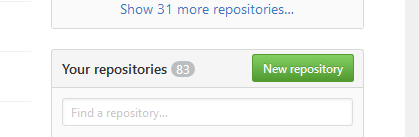

From the **Create a new repository page**, give your repository a name.

Set its accessibility to *public* if you're using a free GitHub account.

Click on **Create repository**.

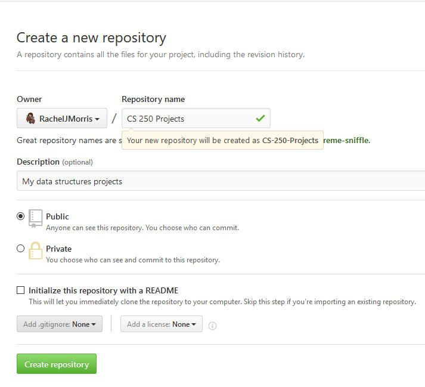

If you didn't select *"Initialize this repository with a README"*, your new repository page will look like this:

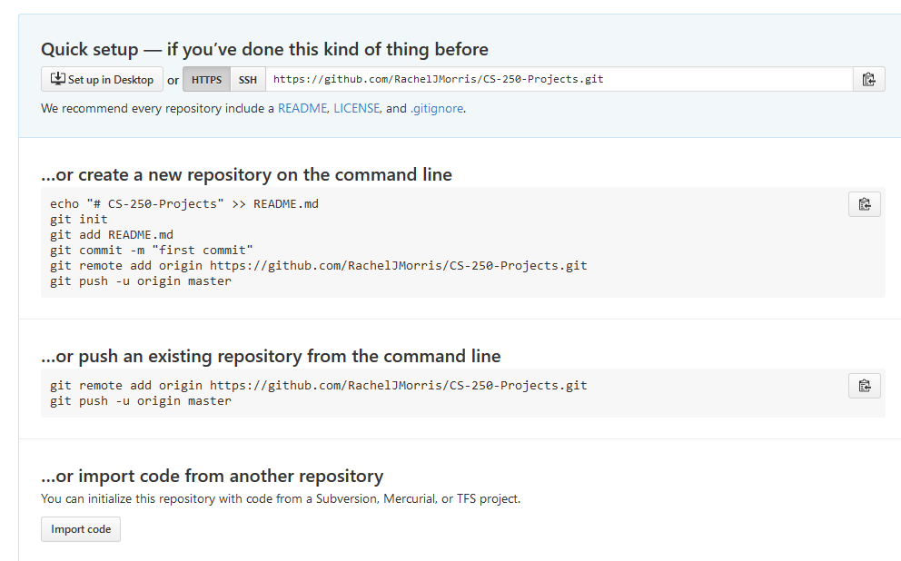

## Cloning the repository onto your local machine

Make sure your **HTTPS** button is selected, and copy the URL next to it.

For example, the repository URL here is:

	https://github.com/RachelJMorris/CS-250-Projects.git

(but don't copy this one!)

Back on your computer, open up the File Explorer and navigate to a folder where you will want to store your repository.

Right-click in the empty space. If **Git Bash** is an option, select it. If it is not available, then **SHIFT+Right Click** the empty space, and select **Open command window here**.

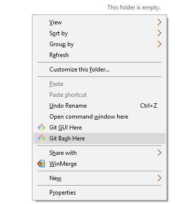

Type in

	git clone

and then paste in your URL by right-clicking the console window.

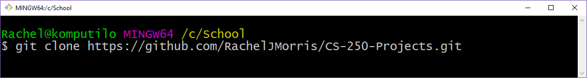

Hit **enter** and your repository will be pulled down from the server...

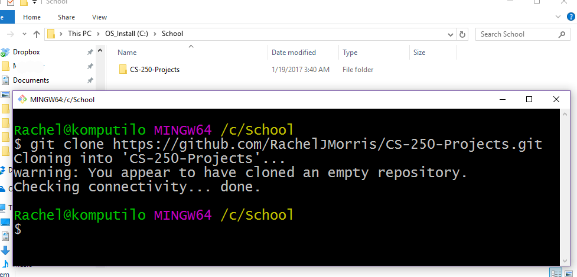

Your repository is now a folder on your hard drive. You can add files and folders within this repository for Git to keep track of for you.

## Adding, committing, and pushing changes

Once you've added files to your repository folder, you may want to take a "snapshot" of your changes so you can go back to them later if you need to.

In the repository directory, right-click the blank space and open either Git Bash, or the terminal.

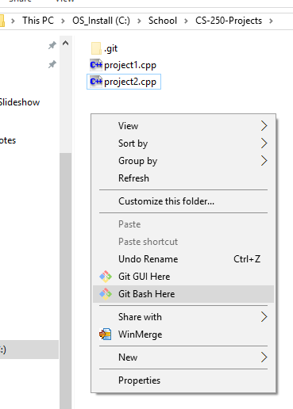

To add a single file at a time to your changeset, use:

	git add (FILENAME)

You can also add multiple files at once:

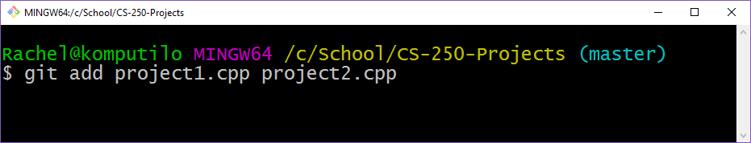

As a shortcut, if you just want to add *all files in this directory, and all subdirectories*, you can use:

	git add .

After your **add**, check the status of your files with

	git status

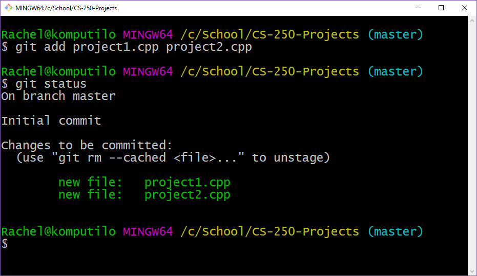

Green files are the files that will be part of your commit.

After you've added all the files that have changed that you want to track, it is time to **commit**. Do the following:

	git commit -m "Description of changes"

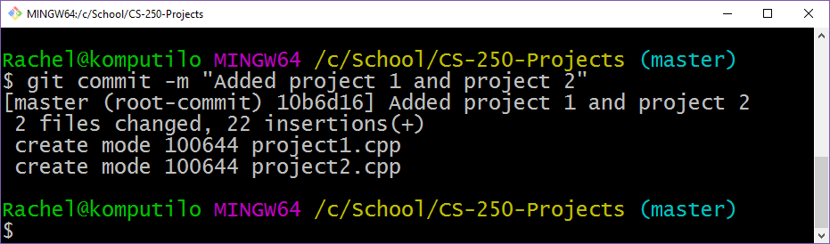

Finally, to push your commit(s) to the server, you will use:

	git push -u origin master

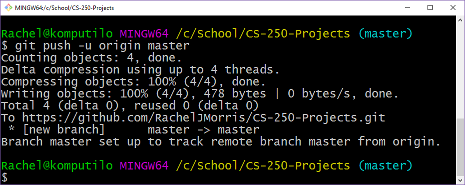

## Pulling down changes

If you're working on multiple computers, and you need to pull down your latest files, you will need to use the **git pull** command.

However, if there are files that have been **changed** but not **committed**, git will complain when you try to execute *git pull*.

The best way to get latest changes is to follow:

1. Add all files that have been changed
2. Commit your changes
3. Use **git pull**
4. (Git will merge) 

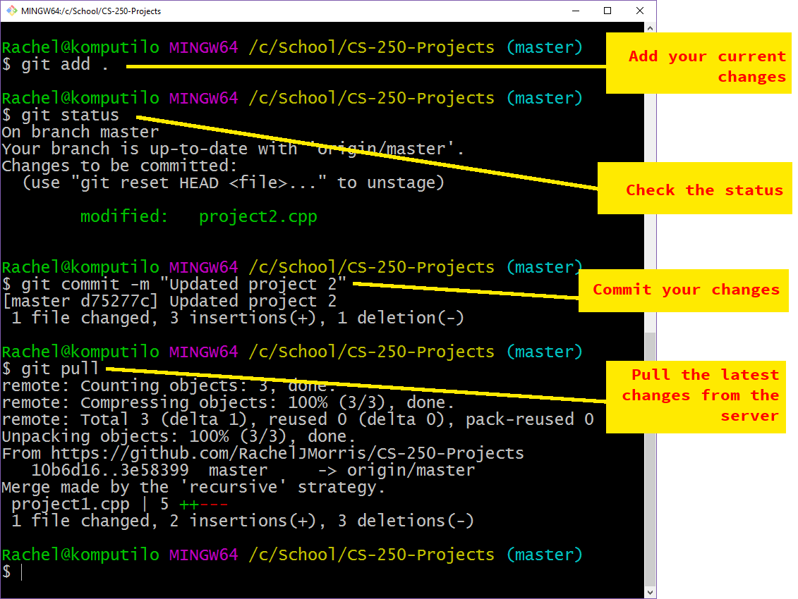

