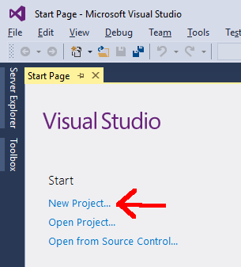
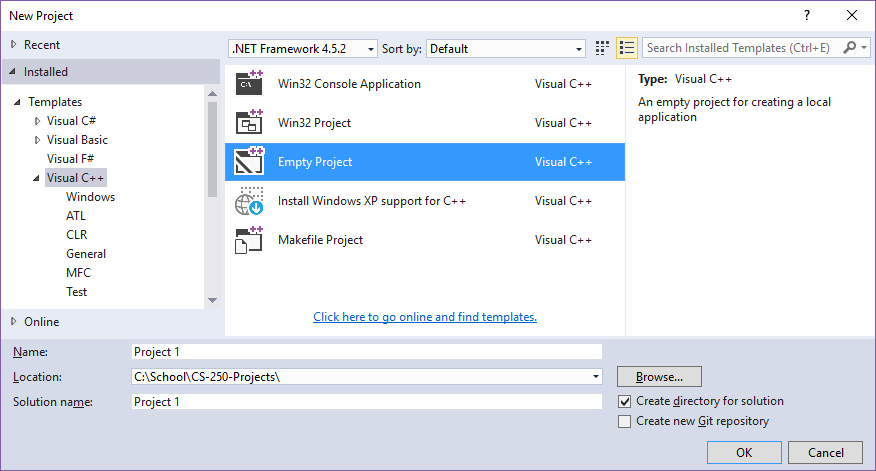
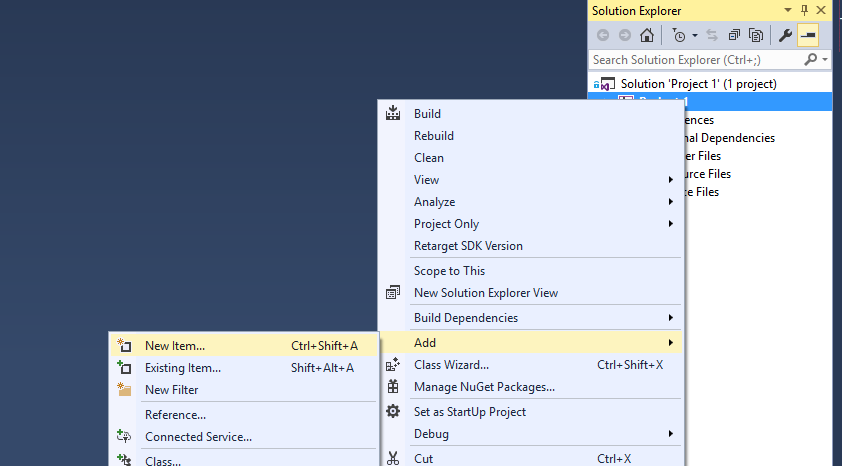
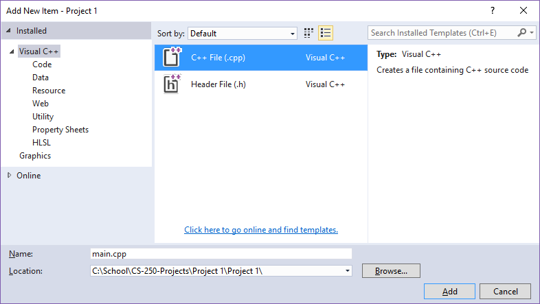
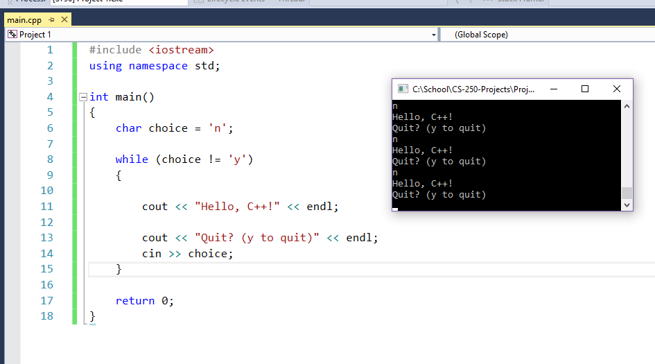

# Visual Studio - How to create a new project

## Create the project

When you first open up Visual Studio, it will have a welcome page.
You can select **New Project** from here, or from **File > New > Project...**

On the **New Project** dialog window, make sure to select **Visual C++** on the left side, and then **Empty Project** in the middle pane.

Set the project **Name** and **Location** at the bottom.

Click on **OK**.

## Add files

The project is created, but will be empty and contain no source files.

In the **Solution Explorer**, right-click your project file and go to **Add > New Item...**

If you're creating the file to store your **main()** function, select the **C++ File**.

Give it a name, and click **Add**.

## Test code

You can add the following code to make sure your program will build:

	#include <iostream>
	using namespace std;
	
	int main()
	{
		char choice = 'n';
	
		while (choice != 'y')
		{
	
			cout << "Hello, C++!" << endl;
	
			cout << "Quit? (y to quit)" << endl;
			cin >> choice;
		}
	
		return 0;
	}

## Build and run

Click on the **(Play) Local Windows Debugger** button in the toolbar.

It may ask if you want to build first before you run. Click on **Yes** -- You will always want to click on Yes here.

If the build fails, it will ask if you still want to run - say NO. Otherwise, if the build was successful, it will run your program.

